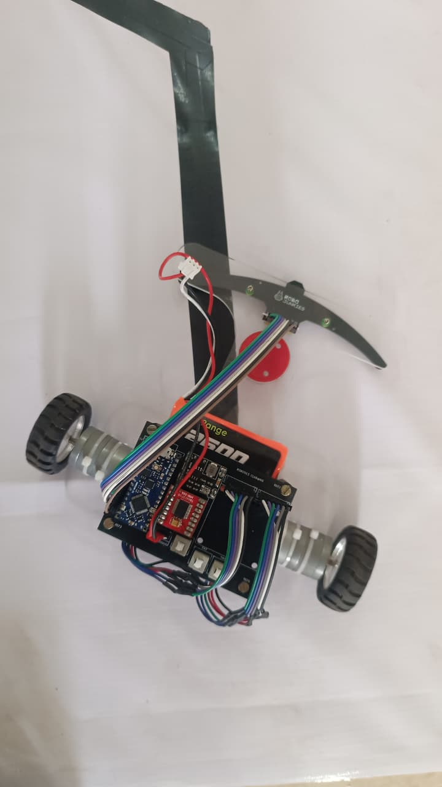

# 🤖 Fast Line Following Robot — Custom PCB + Firmware

> **🥈 2nd Place — Roborikishi 2025 @ NIE Mysore** (40+ teams) &nbsp;|&nbsp; **Participant — IISc Bangalore LFR 2025**

A high-performance line following robot with a **custom-designed and fabricated PCB**, featuring the TB6612FNG dual motor driver, 16-channel IR sensor array via analog MUX, I²C OLED display, and dual motor encoders.

Originally prototyped on **ESP32 WROOM (38-pin)** — the firmware and pinout in this repo reflect that version. The final **custom PCB** was redesigned for **Arduino Nano Every (ATmega4809)** using **KiCad 8.0.7** and professionally fabricated.

---

## 📸 Gallery

### Assembled Robot


> *Fully assembled LFR bot — custom PCB mounted on chassis with TB6612FNG motor driver, IR sensor array, encoder-driven DC motors, and wiring harness.*

### Custom Fabricated PCB


> *Custom PCB designed in KiCad 8.0.7 and fabricated. Multiple boards produced for the Robotics Club @ NIE Mysore.*

---

## 🏆 Competition Results

| Event | Result |
|---|---|
| Roborikishi 2025 — NIE Mysore | 🥈 **2nd Place / 40+ Teams** |
| IISc Bangalore LFR 2025 | Participant |

---

## ✨ Features

- **Custom PCB** — designed from schematic to layout in KiCad 8.0.7, fabricated and assembled
- **Dual motor control** via TB6612FNG (SparkFun ROB-14450) with PWM speed control
- **Motor encoder feedback** — two encoder interfaces for closed-loop PID speed control
- **16-channel IR sensor array** via analog MUX (CD74HC4067) for precision line detection
- **OLED display** (128×64, 1.3", I²C) — real-time status and sensor bar graph
- **Weighted average line position** algorithm with PID correction
- **EEPROM calibration** — sensor min/max values saved across power cycles
- **Hardware buttons** — Start/Stop, Calibrate, Mode toggle (black/white line), Reset
- Modular, well-documented code with individual component test sketches

---

## 🔧 Hardware

### PCB Version (Final — Arduino Nano Every)

| Component | Part / Detail |
|---|---|
| Microcontroller | Arduino Nano Every (ATmega4809, 48KB Flash, 6KB RAM) |
| Motor Driver | TB6612FNG — SparkFun ROB-14450 |
| Display | 128×64 OLED (1.3", I²C — SDA/SCL) |
| Motor Feedback | Dual encoder interfaces (J1 Motor_Encoder1, J4 Motor_Encoder2) |
| Sensor Interface | 16-channel IR array via J2 (analog MUX) |
| Power Switch | SW3 (SW_POWER) |
| OLED Toggle | SW2 (SW_OLED) |
| PCB Design Tool | KiCad EDA 8.0.7 |

### Prototype Version (Firmware in this repo — ESP32 WROOM)

| Component | Part / Detail |
|---|---|
| Microcontroller | ESP32 WROOM (38-pin) |
| Motor Driver | TB6612FNG |
| MUX | 16:1 Analog MUX (CD74HC4067) |
| IR Sensors | 16 IR sensors |
| Display | 128×64 OLED (I²C, SSD1306) |
| Encoders | 2x Quadrature encoders |
| Buttons | 4x Push buttons |
| Buzzer | Active buzzer |

---

## 📐 PCB Schematic Overview

Schematic designed in **KiCad 8.0.7** (see `hardware/` folder):

| Connection | Detail |
|---|---|
| TB6612FNG ↔ MCU | PWMA, PWMB, AIN1, AIN2, BIN1, BIN2, STBY |
| Encoder J1 | Motor Encoder 1 (6-pin) |
| Encoder J4 | Motor Encoder 2 (6-pin) |
| Sensor Array J2 | Multi-channel analog + digital sensor inputs |
| OLED | I²C — SDA / SCL |
| Power | Independent VM (motor) and logic (5V/3V3) rails |
| Switches | SW_POWER (SW3), SW_OLED (SW2) |

---

## 📁 Folder Structure

```
Line-Following-Robot/
├── README.md                  ← This file
├── fastlinefollower.ino       ← Main robot firmware (ESP32 version)
├── component_testing.md       ← Test instructions & expected results
├── pinout_tables.md           ← ESP32 pin assignments
├── index.md                   ← Full project tutorial / blog
├── troubleshooting.md         ← Common issues & fixes
└── hardware/
    ├── pcb_photo.jpg          ← Fabricated PCB photo
    ├── lfr_bot.jpg            ← Assembled robot photo
    ├── lfr.kicad_sch          ← KiCad schematic file
    └── wiring_diagrams/       ← Fritzing / hand-drawn diagrams
```

---

## 🚀 Quick Start

1. **Clone the repo**
   ```bash
   git clone https://github.com/Nikhilkm24/Line-Following-Robot.git
   ```

2. **Test individual components first**
   - Follow `component_testing.md` for motor, encoder, OLED, MUX, button, and buzzer tests

3. **Flash main firmware**
   - Open `fastlinefollower.ino` in Arduino IDE
   - Select **ESP32 WROOM** board + correct COM port
   - Install required libraries: `Adafruit_SSD1306`, `Adafruit_GFX`
   - Upload and run

4. **Calibrate sensors**
   - Press **CAL** button to start 4-second sweep calibration
   - Values are saved to EEPROM automatically

5. **Run**
   - Press **START** button — robot begins following the line
   - Press **MODE** to toggle between black line / white line detection

---

## 📌 ESP32 Pin Map

See full table in [`pinout_tables.md`](pinout_tables.md)

| Signal | ESP32 Pin |
|---|---|
| Motor L PWM / R PWM | 33 / 13 |
| Motor L IN1, IN2 | 26, 25 |
| Motor R IN1, IN2 | 14, 12 |
| STBY | 27 |
| Encoder L A/B | 32, 16 |
| Encoder R A/B | 35, 36 |
| MUX S0–S3 / SIG | 18, 19, 17, 5 / 34 |
| OLED SDA / SCL | 21 / 22 |
| BTN START / CAL / MODE / RESET | 4 / 15 / 23 / 0 |
| Buzzer | 2 |

---

## 📚 PID Algorithm

The robot uses a **weighted average sensor position** mapped to a ±error value, then applies PID correction:

```
error = position - center
correction = Kp*error + Ki*integral + Kd*derivative
leftSpeed  = BASE_SPEED + correction
rightSpeed = BASE_SPEED - correction
```

Default tuning: `Kp=0.25`, `Ki=0.0`, `Kd=8.0` — adjust for your track and motors.

---

## 👨‍💻 Author

**Nikhil K M** — Electronics & Software Lead, Robotics Club @ NIE Mysore
B.Tech ECE, The National Institute of Engineering (2023–2027)
[GitHub](https://github.com/Nikhilkm24)

---

## 📄 License

MIT License — free to use, modify, and distribute with attribution.
